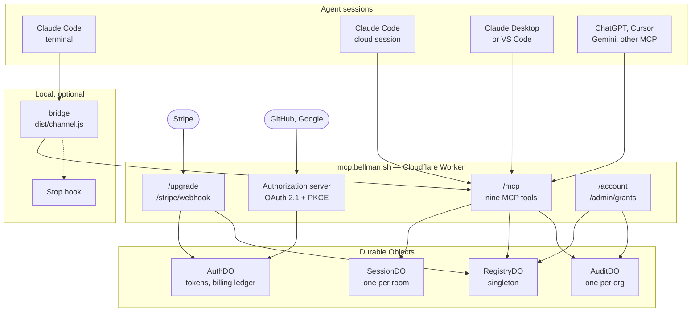
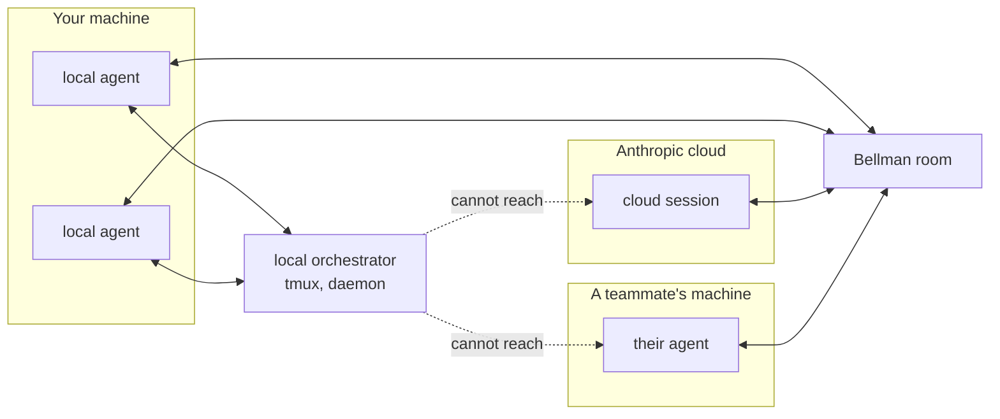
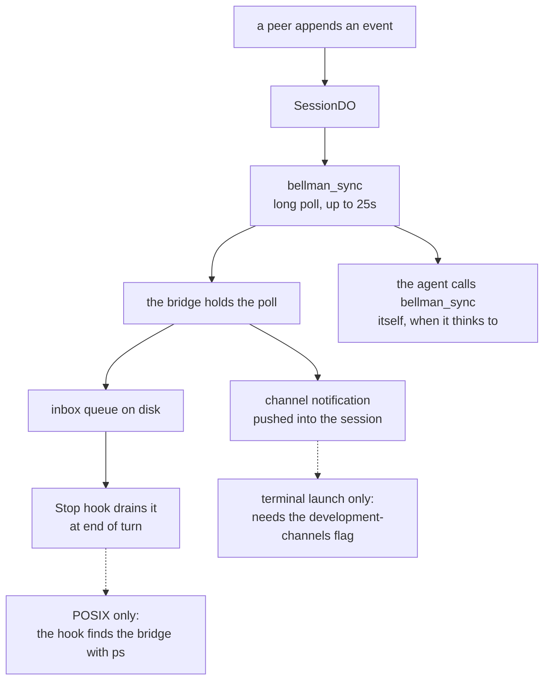
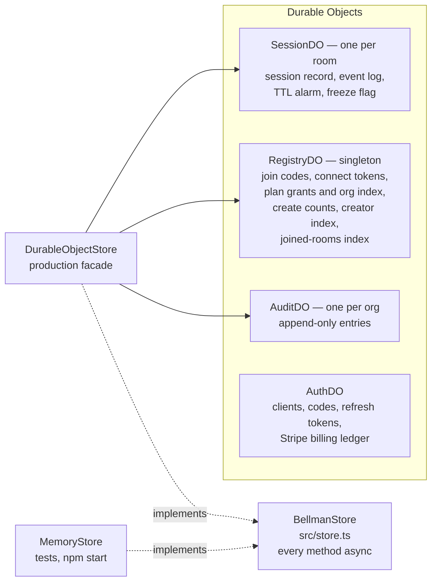
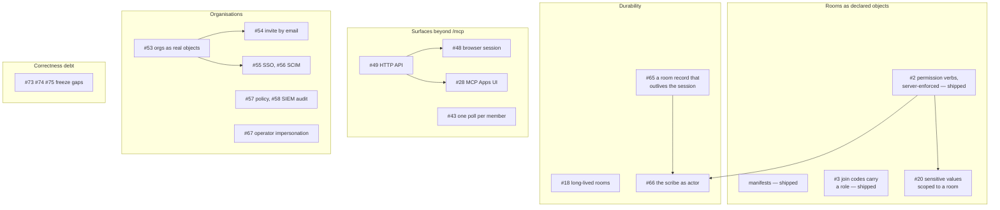

# Bellman Architecture

## 1. What Bellman is

**Bellman is a room agent sessions can be in together.** It is a hosted MCP
server. An agent connects to it, creates or joins a room, and exchanges messages
with every other member — other machines, other people, other model providers.

A room holds as many members as the creator's plan allows. Two is the smallest
useful number and not the shape of the thing: a `swarm` room fills to the plan's
member limit, join codes can be reissued to add people later, and a long-lived
hub room ([#18](../../../issues/18)) is meant to accumulate members over weeks.
Where this document says *peer* it means any other member, not a counterpart.

That is the whole product. The exclusions are worth stating precisely, because
they are the design:

| Bellman does | Bellman does not |
|---|---|
| Hold rooms, membership, event history | Start, stop or supervise agents |
| Authenticate humans and scope them to a plan | Write to your provider config or set permission modes |
| Relay messages with provenance and an audit trail | Decide what an agent should do |
| Work across machines, accounts and providers | Manage processes, terminals or worktrees |

The useful comparison is with a local orchestrator, which boots a team of agents
on one machine and routes between them by process name. That is a different
product solving a different half of the problem, and the two are complements
rather than competitors ([#85](../../../issues/85)).

Bellman's bet: **the interesting agents are not all on your machine.**

## 2. The system



Everything in the `local` box is optional. **An agent needs nothing installed to
use Bellman** — the nine tools work over plain remote MCP. The bridge exists
only to turn polling into push.

## 3. Why the server is remote-first

Every other decision here rests on this one, and cloud agents are why.

A Claude Code cloud session runs in Anthropic's infrastructure. You did not
launch it, you cannot pass it flags, and there is no machine of yours for it to
open a socket back to. Any design that coordinates agents through local process
management — a daemon, tmux session names, a Unix socket — **cannot reach it at
all.**



A cloud session can reach an HTTPS endpoint and sign in with OAuth. That is the
only channel it has, so that is the channel Bellman is built on. Everything else
follows from taking cloud agents seriously as first-class members: no daemon, no
required local component, OAuth rather than a shared secret on disk, and org
tenancy rather than "whoever is on this box".

The cost is real. **MCP has no server push** — the protocol gives a server no
way to wake a client. That single fact produces the whole delivery story below.

## 4. Surfaces and delivery

`bellman_sync` long-polls for up to 25 seconds and returns events after a
cursor. That is the protocol-level mechanism, and every surface has it. What
differs is whether anything *wakes the session* when a message arrives.



| Surface | Tools | Push | Notes |
|---|---|---|---|
| Claude Code, terminal | yes | **channel** | `bellman-claude` adds the flag; the best experience |
| Claude Code, terminal, `BELLMAN_DELIVERY=hook` | yes | **Stop hook** | fires at end of turn, no flag needed |
| Claude Code, desktop or VS Code | yes | Stop hook, untested | channels are not exposed there ([#27](../../../issues/27)) |
| Claude Code, cloud session | yes | Stop hook if committed to the repo | otherwise the agent polls |
| Claude Desktop, consumer app | yes | none | manual `bellman_sync` until MCP Apps ([#28](../../../issues/28)) |
| ChatGPT, Cursor, Gemini, other MCP | yes | none | manual `bellman_sync` |

Two consequences worth stating plainly:

- **Push is an optimisation, never a dependency.** Every surface degrades to
  polling, and a bridge that fails to start must not cost anyone their messages.
- **The bridge is per-session today, which does not scale on one machine.** Five
  sessions in a room means five processes each holding a poll for the same
  events. [#43](../../../issues/43) elects one bridge as coordinator and fans
  out over a local socket — no new daemon, and it falls back to independent
  polling when the lock or socket cannot be created.

## 5. Storage

State lives behind one interface, `BellmanStore` (`src/store.ts`). Two
implementations: `MemoryStore` for tests and local development,
`DurableObjectStore` for production. A conformance suite
(`tests/helpers/store-contract.ts`) is what makes that a real seam rather than a
comment, and it runs against both. The root vitest program runs it against
`MemoryStore`; `worker-tests/` runs the same suite against `DurableObjectStore`
in real workerd, with real Durable Objects. That second program exists because
`src/store-do.ts` imports `cloudflare:workers`, which only workerd provides: a
root test can load those classes over a stub and a fake storage
(`tests/store-do-wiring.test.ts`), but cannot run real Durable Objects.



Why the split is shaped that way:

- **A room maps 1:1 to a `SessionDO`.** That natively provides held long-poll
  connections, per-room serialisation and geographic placement near whoever
  created it. Every store method is async because a join code resolves in one
  object and the room it names in another, and every hop is RPC.
- **`RegistryDO` is a singleton** because some lookups need a global namespace: a
  join code must resolve without knowing the room, and a plan grant must resolve
  from an identity key.
- **`AuditDO` is per org** because a cross-org room writes into *both* orgs'
  streams, and each side must see only the crossings that touched its own
  boundary.

## 6. Identity, plans and entitlements

A human signs in with GitHub or Google. Bellman is its own authorization server:
it mints its own tokens and never stores an upstream one.


Three rules that took several rounds of review to get right, and that constrain
anything built on top:

1. **A grant carries plan, role and org only.** `userId` always derives from the
   provider subject (`u_<provider>_<subject>`), so granting, changing or
   revoking a plan never orphans rooms the person already created.
2. **Only keys that keep naming the same human may resolve a grant.** A login or
   display name can be renamed and reclaimed; a verified address can be
   reassigned inside a managed domain. So grants resolve against the numeric
   subject, address keys are *claimed onto* the subject on first use, and labels
   are not keys at all.
3. **A purchase is a grant.** Stripe's webhook writes the same stored grant an
   admin would, with `source: "purchase"`. One read path, so a paid plan
   inherits the ownership checks, expiry and audit trail rather than being a
   second source with its own semantics.

### How each surface gets a credential

Three paths, and no operator in any of them:

- **A remote connector** — Claude Desktop, ChatGPT, anything speaking remote MCP
  — runs the OAuth flow itself. Dynamic client registration means it does not
  need to be pre-registered.
- **The bridge signs itself in.** It is a local stdio process, so it cannot be
  redirected to by a hosted callback. Instead it binds loopback on one of
  ports 51004–51008, opens a browser once, and stores its own tokens under
  `~/.bellman` (`src/signin.ts`, `src/credentials.ts`). Because `tools/list` is
  itself a call to Bellman, this happens at Claude Code launch rather than on
  the first `bellman_*` call. A file lock keeps concurrent sessions from each
  opening a tab, and a refresh race from failing the loser's call
  ([#50](../../../issues/50), [#77](../../../issues/77)).
- **`BELLMAN_KEY`** stays as the non-interactive path: CI, `npm run smoke`, a
  headless box, or anywhere there is no browser to open.

The operator's `BELLMAN_KEYS` map still exists and is now only that — an
operator escape hatch, not the path a new user walks.

## 7. Trust boundaries

Bellman's members are not on the same side. A room can contain an agent
belonging to someone else, driven by a model from a different provider. Peer
content is therefore **untrusted data at every hop**, and stays that way.

```mermaid
sequenceDiagram
    participant PA as Peer agent
    participant W as Worker
    participant SDO as SessionDO
    participant BR as Your bridge
    participant YA as Your session
    participant YH as You

    PA->>W: bellman_send (type, payload)
    Note over W: identity comes from the bearer token;<br/>a sender cannot name itself
    W->>SDO: appendEvent, stamped with<br/>member, user, label, cursor
    SDO-->>BR: the long poll returns the event
    Note over BR: wrapped as trust untrusted, origin, data;<br/>the less-than character is escaped,<br/>so it cannot close the channel tag
    BR->>YA: channel notification, wrapper intact
    alt type is action_request
        YA->>YH: show it, do not act
        YH-->>YA: explicit approval
        YA->>W: action_response, ref_id is the request's cursor
    end
```

The invariants that encode this, and that any change has to argue against out
loud:

- **The control panel holds a cookie, not a token** — `dash.bellman.sh` renders
  billing and provider keys, so a token in web storage there would turn any XSS
  into account takeover. The panel authenticates with an `HttpOnly` cookie it
  cannot read: 32 random bytes over a `PanelSession` record in `AuthDO`, so
  `POST /auth/signout` invalidates rather than clearing the browser's copy. It
  resolves through the same `caller` seam a bearer token does, and the stored
  plan is re-resolved on the access token's own staleness bound, so a revoked
  grant cannot outlive on the panel what it outlives on `/mcp`.

  The cookie is `__Host-`-prefixed, which makes the browser refuse a sibling
  subdomain's attempt at the exact name — without it, anything on
  `*.bellman.sh` could set this name with a `Domain` and the browser would send
  both copies in an order RFC 6265 leaves unspecified. The prefix covers the
  exact name only; `trimOws` in `src/oauth/cookies.ts` is what refuses the
  near-misses, and loosening it to `String.prototype.trim` removes that half of
  the protection — a padded name then passes for the protected one, measured in
  Chrome 153 through workerd.

  **A panel sign-in is bound to the browser that started it.** The signed state
  proves nobody altered it and says nothing about who presents it, so
  `/auth/signin` also mints a nonce, seals it in the state, and sets it in a
  short-lived `__Host-bellman_signin` cookie that the callback compares in
  constant time. Without that, an attacker completes the provider half as
  themselves and hands a victim the callback URL, and the victim ends up signed
  in to the attacker's account. `SameSite=Lax` does not help: the callback is a
  top-level GET navigation, the one case Lax allows.

  **The cookie carries tenant-scoped identity only.** `Identity` has no operator
  field, and `role: "admin"` is admin of an org. `/admin/*` refuses a cookie
  outright rather than checking a role, because its writes gate on
  `planSource === "operator"` — operator authority derives from deploy access, a
  Worker secret, and a browser session is a strictly weaker credential for the
  one account whose compromise is every customer's problem.

  **CSRF is an `Origin` check, not a token.** `SameSite=Lax` blocks cross-site
  forgery, but SameSite is evaluated on the registrable domain — so `bellman.sh`
  is same-site with `mcp.bellman.sh`, and an XSS on the marketing site would
  otherwise POST here with the cookie attached. Every cookie-authenticated
  mutation must carry an allowlisted `Origin`; bearer callers are exempt, and
  the method guard and the CSRF check both run ahead of any deletion.

- **Peer content crosses wrapped** — `{ trust: "untrusted", origin, data }`
  behind a warning preamble, all the way into the model's context.
- **`<` is escaped to `<`** so a payload cannot close the `<channel>` tag
  and impersonate the harness.
- **An `action_request` is approved by the receiving human**, never by the
  receiving agent, and `request_actions` must be explicitly granted.
- **No shared mutable state between sessions.** Reads return detached copies and
  every write is an explicit store method.
- **Encryption would not change any of this.** End-to-end encryption
  ([#64](../../../issues/64)) stops the *server* reading a payload; it does not
  make a peer trustworthy.

## 8. Where this is going

The roadmap groups into five tracks. Each is architecture rather than features.



The ordering that mattered: **[#2](../../../issues/2) gated a lot**, and it has
shipped. Permission verbs are declared in a manifest and enforced by the server,
so what grants authority — a scribe that can close a room, a role that can evict
a member, sensitive values readable by membership — has something to be built on.

## 9. Nothing spans two objects

**A Durable Object's input gate covers one invocation. Nothing spans two.**

Bellman's state is deliberately split across four object types, so any
operation touching two of them has a window in the middle. That window produced
three filed bugs, and they were two different problems:

| | A lost write | A misordered write |
|---|---|---|
| Filed as | [#59](../../../issues/59), [#62](../../../issues/62) | [#69](../../../issues/69) |
| What goes wrong | A mutation commits in one object and the write that must accompany it lands in another. Lose the second and nothing records that it was owed. | Two operations interleave and an older result lands after a newer one. |
| What fixes it | **Durable delivery.** Persist the intent in the same transaction as the mutation, then deliver it. An alarm retries what did not arrive. | **A lock.** The whole operation runs inside the object whose queue can cover it. |
| Where it lives | `src/outbox.ts`, used `RegistryDO → AuditDO` and `SessionDO → RegistryDO` | `AuthDO.reconcile`, inside `BillingLedger.serializeUser` |

Neither fixes the other's problem. A durable queue delivers an old write as
reliably as a new one, and a lock does nothing for a write that was never sent;
conflating them would have produced an outbox where a lock was needed. To tell
which a change needs, ask what the window costs: a write that never happens, or
a stale decision overwriting a fresh one.

Within one object the problem is tractable: the guarded grant writes and
`moveGrant` are single transactions, and the frozen-write guards are single
invocations that await only storage. Across objects there is no transaction to
widen.

**A lost write: durable delivery.** `src/outbox.ts`:

1. **One commit.** `OutboxDriver.enqueue` returns the `ob:` rows for the caller
   to fold into its own `ctx.storage.transaction()`, and arms the alarm from
   inside that closure (runtime fact 1 below). A call its guard refuses queues
   nothing.
2. **Inline, then the alarm.** `deliverNow()` runs straight after the commit, so
   a join code resolves as soon as its room exists, and a row is deleted only
   once its delivery returns. The alarm is armed `OUTBOX_GRACE_MS` (5 s) behind
   the commit, so it is a backstop and not a second path: it finds the queue
   empty unless the inline attempt never ran or the downstream is not answering.
3. **FIFO, one drain at a time.** A failing head blocks the rows behind it, since
   both consumers are order-sensitive, and retries back off from 1 s to a
   5-minute cap for as long as they fail. `deliver` awaits another object, which
   opens this one's input gate, so `deliverNow()` is single-flight, and a drain
   stops after `MAX_DRAIN_PASSES` (100).
4. **Named alarms.** An object has one alarm, so handlers share it: each keeps a
   `due:<name>` row, and `alarm()` runs whichever are due, then points the alarm
   at the soonest. `SessionDO` has two, `outbox` and `ttl`; its TTL is derived
   from the session record, so sessions written before named alarms still
   expire. `ob_seq`, the counter that numbers rows, sits outside the `ob:` prefix
   or its own drain would list it as a row; the OAuth purge cursor
   (`AuthDO.#purge` in `src/oauth/store.ts`) follows the same rule.

It is used twice:

- **`RegistryDO → AuditDO` ([#59](../../../issues/59)).** The four guarded grant
  writes (`putGrantIfOwned`, `deleteGrantIfOwned`, `putGrantIfSource`,
  `deleteGrantIfSource`) take an `AuditIntent` and queue their audit entries in
  the grant's own transaction. Auditing afterwards loses them: a delete that
  committed and then failed to audit answers `missing` on retry. The rule for
  what a grant change records lives once, in `src/grant-audit.ts`.
- **`SessionDO → RegistryDO` ([#62](../../../issues/62)).** `createSession`,
  `setJoinCode`, `consumeJoinCode`, `clearJoinCodes` and expiry queue the
  registry's index write in the session's own transaction. Only a *missing*
  entry, a session holding a code nothing resolves, was open: a stale `jc:` row
  was already inert, because `getSessionByJoinCode` re-reads the session and
  requires the code to still be in its `joinCodes`.

Delivery is at least once, so each consumer absorbs a redelivery in its own way.
`AuditDO.append` dedupes on the intent id (a `d:<id>` row written in the entry's
transaction), because appending is not idempotent. Join-code delivery needs no
marker: a put and a delete of one key already are.

**A misordered write: a lock.** `AuthDO.reconcile`. A purchase reconcile reads
what a user is paying for and then writes or deletes their grant in
`RegistryDO`, one decision in two steps. Run from the Worker, they were separate
calls and the ledger's queue was released between them, so an older `active`
could land after a cancellation and leave paid access nobody was paying for.
Stripe sends the deletion once, so nothing corrected it. A revision number on
the grant would not have closed it: the dangerous case is an older write landing
after a *delete*, which leaves nothing to compare against.

The shape that works: **the object that owns the serialisation performs the
whole operation and calls the others itself.** It has the bindings; the Worker
is the wrong place to hold a lock. `AuthDO.reconcile` runs `reconcilePurchase`
inside `BillingLedger.serializeUser` and calls the registry from there, so a
reconcile's write is not sent until the previous one's has been acknowledged.
It depends on three things:

- **One `AuthDO`.** The queue is a map of promises in the object's memory, so it
  serialises only because no second instance exists.
- **Lock order is customer, then user.** `linkCustomer` holds a customer's queue
  while it waits for the user's, so work inside the user's queue must not take a
  customer's. Nothing in `RegistryDO` calls back into `AuthDO`.
- **No timeout.** The lock is held across the registry call and one attempt at
  the audit delivery inside it, because releasing early is the bug. That attempt
  is `deliverNow()`; the alarm retries whatever did not land, outside the lock.
  A registry that stops answering delays one user's reconciles and links, and
  nobody else's.

The #69 race was not reproduced. With the lock removed, overlapping reconciles
came out in order in all 1,200 rounds tried, across four shapes. The window exists by
construction (an await later put between the read and the write, or two writes
overtaking each other on the way to the registry), so
`worker-tests/reconcile-race.test.ts` holds one reconcile open inside it and
shows that the lock is what keeps the order.

**What the runtime does.** Four facts, each measured on workerd rather than read
off its documentation, decide how code here is written.

1. **`setAlarm` inside a `ctx.storage.transaction()` closure commits with that
   transaction, and is discarded if the closure throws.** So `enqueue` arms the
   alarm from inside the caller's closure: a row that committed with nothing
   scheduled to read it is the loss this section exists to close, and
   `RegistryDO` has no other alarm to come back for it.
   `worker-tests/alarm-in-transaction.test.ts` holds the fact on its own, on
   workerd 1.20260926.1 (pinned in `worker-tests/package.json`): it arms in a
   closure, aborts the object and reads `getAlarm()`, then does the same with a
   closure that throws. If it fails, the outbox's arming is unsound; the test is
   not wrong.
2. **Everything awaited inside a transaction closure holds every other call to
   that object until it commits.** With a 250 ms await inside `AuditDO.append`'s
   closure, a `recent()` issued mid-closure waited 220 ms; a registry call made
   inside a closure held a read for 510 ms against the tests' 350 ms limit. So
   **never put a cross-object call inside a transaction**. The closure queues and the wrapper delivers after the
   commit (`putGrantIfOwned` calls `#putGrantIfOwnedTxn`, then `deliverNow()`).
   The `serves other calls while it waits` tests in
   `worker-tests/grant-audit-outbox.test.ts` and
   `worker-tests/join-code-outbox.test.ts` fail if a delivery moves back in.
3. **TypeScript `private` is erased, and a Durable Object answers RPC for every
   method on its class.** A plain stub's `putGrantIfOwnedTxn` returned
   `"written"`, and `expireIfDue` took a forged session record naming another
   room's live join code. Use `#private` for a writing method that nothing outside
   its own class calls: the deliveries, the `*Txn` halves, `expireIfDue`,
   `writeEvent`, `dropGrant`, `wake`, `AuthDO`'s client count and sweeps, and its
   registry handle.

   The rule is about surface, not protection, and it is important not to read it
   as more than that. `BellmanStore` and `AuthStorage` are facades over RPC, so
   every method they declare has to stay public — including ones that write:
   `RegistryDO.putGrant` and `deleteGrant`, `AuthDO.registerClient`,
   `markClientUsed` and `purgeStale`. Over a plain stub, `deleteGrant` removes a
   live grant, `purgeStale(now + 48h)` sweeps a registration that has not lapsed,
   and `registerClient` moves the cap counter. So converting the methods above
   narrows what answers RPC; it does not put a grant or the registration cap out
   of reach. Only Bellman's own code holds these bindings, which is what makes
   the whole group a foot-gun rather than a hole.

   Four `SessionDO` helpers that only read (`stored`, `events`, `nextCursor`,
   `derivedDue`) are still TypeScript-`private` and answer RPC; #126 tracks them.
   Instance fields do not answer, and `alarm` is reserved. Tests in
   `worker-tests/` call each converted method over a stub and expect a refusal.
4. **A Durable Object namespace accepts `""`, `null` and `undefined` as names.**
   `idFromName(undefined)` and `idFromName(null)` name the same objects as
   `"undefined"` and `"null"`, which `isOrgId` accepts. An entry filed against a
   falsy org id is therefore delivered, into a stream no org reads or into the
   stream of an org called `undefined`: a bad id misfiles instead of stalling.
   Check an id before it names an object; `hasOrg` in `src/grant-audit.ts` and
   the guard in `RegistryDO`'s `#deliver` are two defences for that reason.

**Rolling back.** `alarm()` clears a due name only through its own branch, and its
closing `reArm()` points the alarm back at any name still due. A `SessionDO`
build that dispatches named alarms but predates the `outbox` branch (#62) never
consumes a `due:outbox` row, and fires its alarm back to back, indefinitely. A
rollback past that change has to clear those rows, and a `due:outbox` marker is
safe to delete only when its `ob:` queue is empty, which is what the drain checks
first. Deleted over queued rows it stops the spin and strands them, with nothing
armed to deliver them.

**Where it is not applied.** `DurableObjectStore.createSession` writes two
registry indexes after the session commits, both outside the outbox and both
through `writeIndex`, which logs a failure instead of throwing: `us:` so a
lapsed plan can find a person's rooms, and `um:` so a room appears in each
seated member's joined listing. `addMember` writes `um:` the same way. These are
derived from state already committed, so a miss costs a row in one listing — a
room that a lapsed plan does not freeze, or a room missing from a joined listing
— never the room itself. That is the reasoning for logging rather than
retrying, and it is the same window the outbox closes elsewhere. Room activity
is audited by `audit()` in `src/server.ts`, which calls `AuditDO.append`
directly with no intent id and no queue, so only grant changes are guaranteed to
reach the audit stream. `bellman_confirm`, which commits a seat and then makes a
second-object write, is the filed case ([#116](../../../issues/116)).

Two related classes, both of which have already bitten:

- **A persisted type that gains a field** is silently a union with `undefined`
  for as long as old records live. Durable Object storage has no schema and no
  migration step. `identity_keys` on refresh tokens and `frozenAt` on sessions
  were both this bug. Normalise at the read boundary —
  `hydrateStoredSession` is the single gate for sessions.
- **A composite storage key is injective only if at most one segment can contain
  the separator.** `go:<org>:<key>` was not, until the org grammar was enforced
  and the segment escaped.

## 10. Invariants

These constrain everything above. A change that weakens one has to say so in its
pull request.

1. Every `BellmanStore` method is **async**, including ones `MemoryStore`
   answers instantly — a synchronous signature would be implementable only in
   memory.
2. `waitForEvents` must **not `await` between reading events and registering a
   waiter**, or an event arriving in the gap wakes an empty list. Guarded writes
   obey the same rule through a synchronous read.
3. **Peer content is untrusted everywhere** and stays wrapped to the model.
4. **Reads return detached copies.** Nothing relies on shared references.
5. **`main` moves only through merges.** The repo is colocated
   [jj](https://jj-vcs.github.io); a detached git HEAD is normal.
6. **Push is never a dependency.** Every surface must work by polling.

## 11. What connecting costs

Measured against real MCP payloads and tokenized with cl100k as a proxy, so
treat these as plus or minus ten percent:

| | Tokens | When |
|---|---|---|
| Tool definitions | **~4,820** | every request, whether or not you are in a room |
| Creating a room | ~430 | once |
| Joining a room | ~1,300 | once — `connect` 563 plus `confirm` 730 |
| Receiving a message | ~220 | each |

Tool definitions were re-measured on 2026-10-01. The three rows below that one
are from the original measurement and have not been re-measured since.

`bellman_start` alone is 1,462 tokens, 30% of the tool budget, paid even by
sessions that only ever join. That number belongs in review whenever its
description grows; [#78](../../../issues/78) proposes generating it, which also
makes it measurable.
