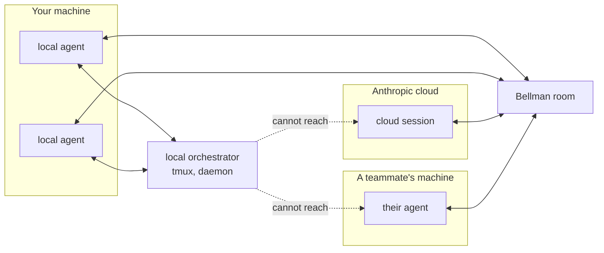
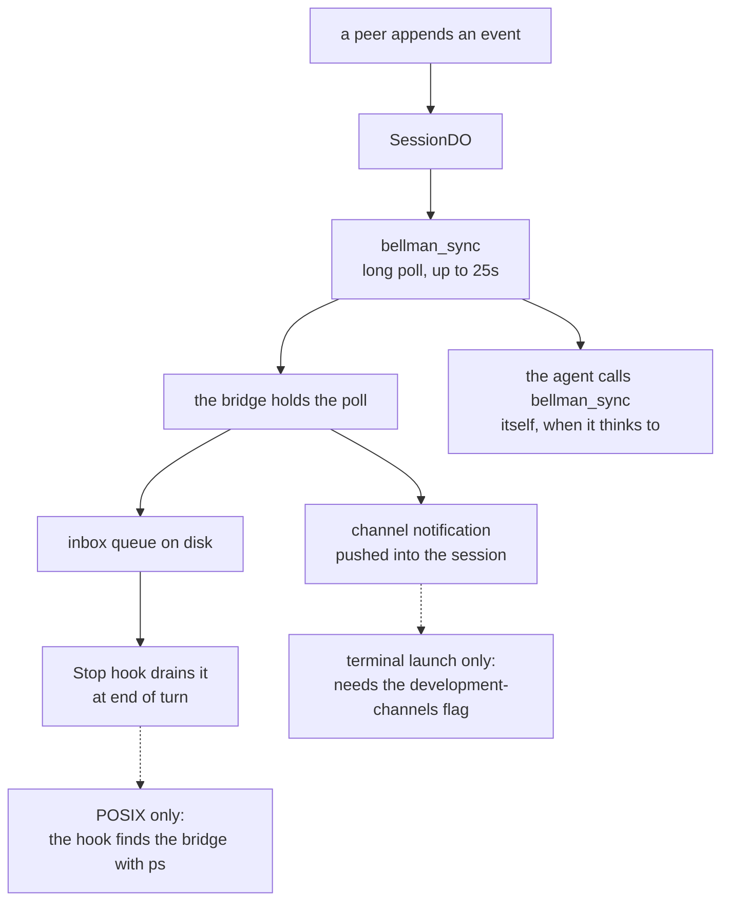
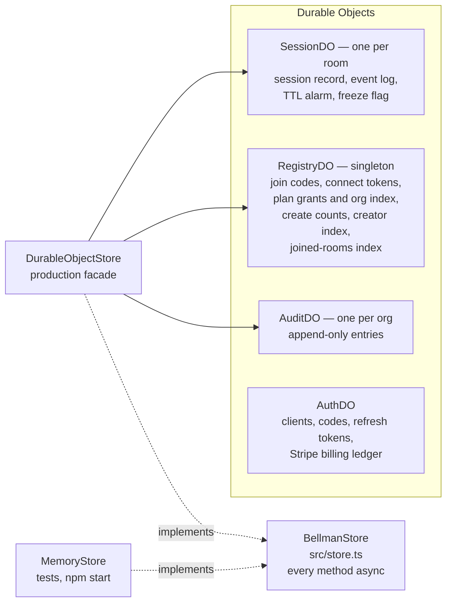
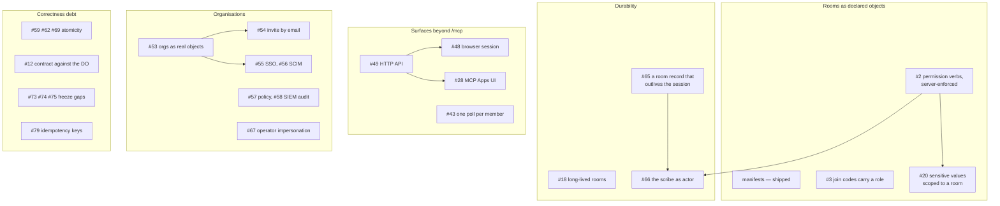

# Bellman Architecture

## 1. What Bellman is

**Bellman is a room agent sessions can be in together.** It is a hosted MCP
server. An agent connects to it, creates or joins a room, and exchanges messages
with every other member — other machines, other people, other model providers.

A room holds as many members as the creator's plan allows. Two is the smallest
useful number and not the shape of the thing: a `swarm` room fills to the plan's
member limit, join codes can be reissued to add people later, and a long-lived
hub room ([#18](../../../issues/18)) is meant to accumulate members over weeks.
Where this document says *peer* it means any other member, not a counterpart.

That is the whole product. The exclusions are worth stating precisely, because
they are the design:

| Bellman does | Bellman does not |
|---|---|
| Hold rooms, membership, event history | Start, stop or supervise agents |
| Authenticate humans and scope them to a plan | Write to your provider config or set permission modes |
| Relay messages with provenance and an audit trail | Decide what an agent should do |
| Work across machines, accounts and providers | Manage processes, terminals or worktrees |

The useful comparison is with a local orchestrator, which boots a team of agents
on one machine and routes between them by process name. That is a different
product solving a different half of the problem, and the two are complements
rather than competitors ([#85](../../../issues/85)).

Bellman's bet: **the interesting agents are not all on your machine.**

## 2. The system


Everything in the `local` box is optional. **An agent needs nothing installed to
use Bellman** — the nine tools work over plain remote MCP. The bridge exists
only to turn polling into push.

## 3. Why the server is remote-first

Every other decision here rests on this one, and cloud agents are why.

A Claude Code cloud session runs in Anthropic's infrastructure. You did not
launch it, you cannot pass it flags, and there is no machine of yours for it to
open a socket back to. Any design that coordinates agents through local process
management — a daemon, tmux session names, a Unix socket — **cannot reach it at
all.**



A cloud session can reach an HTTPS endpoint and sign in with OAuth. That is the
only channel it has, so that is the channel Bellman is built on. Everything else
follows from taking cloud agents seriously as first-class members: no daemon, no
required local component, OAuth rather than a shared secret on disk, and org
tenancy rather than "whoever is on this box".

The cost is real. **MCP has no server push** — the protocol gives a server no
way to wake a client. That single fact produces the whole delivery story below.

## 4. Surfaces and delivery

`bellman_sync` long-polls for up to 25 seconds and returns events after a
cursor. That is the protocol-level mechanism, and every surface has it. What
differs is whether anything *wakes the session* when a message arrives.



| Surface | Tools | Push | Notes |
|---|---|---|---|
| Claude Code, terminal | yes | **channel** | `bellman-claude` adds the flag; the best experience |
| Claude Code, terminal, `BELLMAN_DELIVERY=hook` | yes | **Stop hook** | fires at end of turn, no flag needed |
| Claude Code, desktop or VS Code | yes | Stop hook, untested | channels are not exposed there ([#27](../../../issues/27)) |
| Claude Code, cloud session | yes | Stop hook if committed to the repo | otherwise the agent polls |
| Claude Desktop, consumer app | yes | none | manual `bellman_sync` until MCP Apps ([#28](../../../issues/28)) |
| ChatGPT, Cursor, Gemini, other MCP | yes | none | manual `bellman_sync` |

Two consequences worth stating plainly:

- **Push is an optimisation, never a dependency.** Every surface degrades to
  polling, and a bridge that fails to start must not cost anyone their messages.
- **The bridge is per-session today, which does not scale on one machine.** Five
  sessions in a room means five processes each holding a poll for the same
  events. [#43](../../../issues/43) elects one bridge as coordinator and fans
  out over a local socket — no new daemon, and it falls back to independent
  polling when the lock or socket cannot be created.

## 5. Storage

State lives behind one interface, `BellmanStore` (`src/store.ts`). Two
implementations: `MemoryStore` for tests and local development,
`DurableObjectStore` for production. A conformance suite
(`tests/helpers/store-contract.ts`) is what makes that a real seam rather than a
comment — though it does not yet run against the Durable Object implementation
([#12](../../../issues/12)).



Why the split is shaped that way:

- **A room maps 1:1 to a `SessionDO`.** That natively provides held long-poll
  connections, per-room serialisation and geographic placement near whoever
  created it. Every store method is async because a join code resolves in one
  object and the room it names in another, and every hop is RPC.
- **`RegistryDO` is a singleton** because some lookups need a global namespace: a
  join code must resolve without knowing the room, and a plan grant must resolve
  from an identity key.
- **`AuditDO` is per org** because a cross-org room writes into *both* orgs'
  streams, and each side must see only the crossings that touched its own
  boundary.

## 6. Identity, plans and entitlements

A human signs in with GitHub or Google. Bellman is its own authorization server:
it mints its own tokens and never stores an upstream one.


Three rules that took several rounds of review to get right, and that constrain
anything built on top:

1. **A grant carries plan, role and org only.** `userId` always derives from the
   provider subject (`u_<provider>_<subject>`), so granting, changing or
   revoking a plan never orphans rooms the person already created.
2. **Only keys that keep naming the same human may resolve a grant.** A login or
   display name can be renamed and reclaimed; a verified address can be
   reassigned inside a managed domain. So grants resolve against the numeric
   subject, address keys are *claimed onto* the subject on first use, and labels
   are not keys at all.
3. **A purchase is a grant.** Stripe's webhook writes the same stored grant an
   admin would, with `source: "purchase"`. One read path, so a paid plan
   inherits the ownership checks, expiry and audit trail rather than being a
   second source with its own semantics.

### How each surface gets a credential

Three paths, and no operator in any of them:

- **A remote connector** — Claude Desktop, ChatGPT, anything speaking remote MCP
  — runs the OAuth flow itself. Dynamic client registration means it does not
  need to be pre-registered.
- **The bridge signs itself in.** It is a local stdio process, so it cannot be
  redirected to by a hosted callback. Instead it binds loopback on one of
  ports 51004–51008, opens a browser once, and stores its own tokens under
  `~/.bellman` (`src/signin.ts`, `src/credentials.ts`). Because `tools/list` is
  itself a call to Bellman, this happens at Claude Code launch rather than on
  the first `bellman_*` call. A file lock keeps concurrent sessions from each
  opening a tab, and a refresh race from failing the loser's call
  ([#50](../../../issues/50), [#77](../../../issues/77)).
- **`BELLMAN_KEY`** stays as the non-interactive path: CI, `npm run smoke`, a
  headless box, or anywhere there is no browser to open.

The operator's `BELLMAN_KEYS` map still exists and is now only that — an
operator escape hatch, not the path a new user walks.

## 7. Trust boundaries

Bellman's members are not on the same side. A room can contain an agent
belonging to someone else, driven by a model from a different provider. Peer
content is therefore **untrusted data at every hop**, and stays that way.

```mermaid
sequenceDiagram
    participant PA as Peer agent
    participant W as Worker
    participant SDO as SessionDO
    participant BR as Your bridge
    participant YA as Your session
    participant YH as You

    PA->>W: bellman_send (type, payload)
    Note over W: identity comes from the bearer token;<br/>a sender cannot name itself
    W->>SDO: appendEvent, stamped with<br/>member, user, label, cursor
    SDO-->>BR: the long poll returns the event
    Note over BR: wrapped as trust untrusted, origin, data;<br/>the less-than character is escaped,<br/>so it cannot close the channel tag
    BR->>YA: channel notification, wrapper intact
    alt type is action_request
        YA->>YH: show it, do not act
        YH-->>YA: explicit approval
        YA->>W: action_response, ref_id is the request's cursor
    end
```

The invariants that encode this, and that any change has to argue against out
loud:

- **Peer content crosses wrapped** — `{ trust: "untrusted", origin, data }`
  behind a warning preamble, all the way into the model's context.
- **`<` is escaped to `<`** so a payload cannot close the `<channel>` tag
  and impersonate the harness.
- **An `action_request` is approved by the receiving human**, never by the
  receiving agent, and `request_actions` must be explicitly granted.
- **No shared mutable state between sessions.** Reads return detached copies and
  every write is an explicit store method.
- **Encryption would not change any of this.** End-to-end encryption
  ([#64](../../../issues/64)) stops the *server* reading a payload; it does not
  make a peer trustworthy.

## 8. Where this is going

The roadmap groups into five tracks. Each is architecture rather than features.



The ordering that matters: **[#2](../../../issues/2) gates a lot.** Permission
verbs are declared in a manifest today and not enforced, so anything that grants
authority — a scribe that can close a room, a role that can evict a member,
sensitive values readable by membership — waits on enforcement being real.

## 9. Nothing spans two objects

**A Durable Object's input gate covers one invocation. Nothing spans two.**

Bellman's state is deliberately split across three object types, so any
operation touching two of them has a window in the middle. That one fact has
produced three separately filed bugs:

| Issue | The two objects | What can go wrong |
|---|---|---|
| [#59](../../../issues/59) | RegistryDO + AuditDO | a durable grant change whose audit entry is lost permanently, because the retry cannot tell the mutation already happened |
| [#62](../../../issues/62) | SessionDO + RegistryDO | a consumed single-use join code that stays redeemable; a joined-rooms index entry (`um:`) lost after the member was added or seated at creation, leaving a room out of one listing |
| [#69](../../../issues/69) | AuthDO + RegistryDO | an older subscription state landing after a newer cancellation, leaving paid access nobody is paying for |

Within one object the problem is tractable and has been solved in place:
`putGrantIfOwned`, `deleteGrantIfSource`, `moveGrant` and the frozen-write
guards are each a single transaction. Across objects there is no such move, and
three ad-hoc patches would be worse than one pattern.

The shape that works: **the object that owns the serialisation performs the
whole operation and calls the others itself.** It has the bindings; the Worker
is the wrong place to hold a lock.

Two related classes, both of which have already bitten:

- **A persisted type that gains a field** is silently a union with `undefined`
  for as long as old records live. Durable Object storage has no schema and no
  migration step. `identity_keys` on refresh tokens and `frozenAt` on sessions
  were both this bug. Normalise at the read boundary —
  `hydrateStoredSession` is the single gate for sessions.
- **A composite storage key is injective only if at most one segment can contain
  the separator.** `go:<org>:<key>` was not, until the org grammar was enforced
  and the segment escaped.

## 10. Invariants

These constrain everything above. A change that weakens one has to say so in its
pull request.

1. Every `BellmanStore` method is **async**, including ones `MemoryStore`
   answers instantly — a synchronous signature would be implementable only in
   memory.
2. `waitForEvents` must **not `await` between reading events and registering a
   waiter**, or an event arriving in the gap wakes an empty list. Guarded writes
   obey the same rule through a synchronous read.
3. **Peer content is untrusted everywhere** and stays wrapped to the model.
4. **Reads return detached copies.** Nothing relies on shared references.
5. **`main` moves only through merges.** The repo is colocated
   [jj](https://jj-vcs.github.io); a detached git HEAD is normal.
6. **Push is never a dependency.** Every surface must work by polling.

## 11. What connecting costs

Measured against real MCP payloads and tokenized with cl100k as a proxy, so
treat these as plus or minus ten percent:

| | Tokens | When |
|---|---|---|
| Tool definitions | **~4,820** | every request, whether or not you are in a room |
| Creating a room | ~430 | once |
| Joining a room | ~1,300 | once — `connect` 563 plus `confirm` 730 |
| Receiving a message | ~220 | each |

Tool definitions were re-measured on 2026-10-01. The three rows below that one
are from the original measurement and have not been re-measured since.

`bellman_start` alone is 1,462 tokens, 30% of the tool budget, paid even by
sessions that only ever join. That number belongs in review whenever its
description grows; [#78](../../../issues/78) proposes generating it, which also
makes it measurable.
