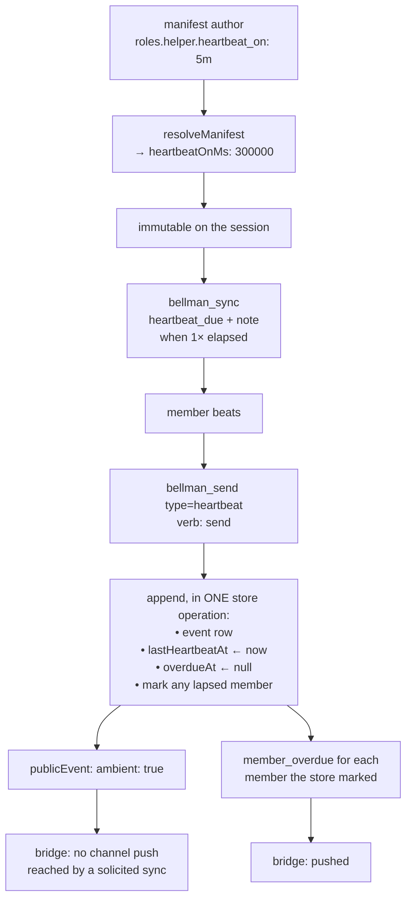

# Heartbeat Events — Design

Issues: [#111 Heartbeat events, and a member declaring that it will send them](https://github.com/bellman-sh/bellman/issues/111)
Status: approved design, pending implementation plan
Related: [#103](https://github.com/bellman-sh/bellman/issues/103) (liveness, shipped —
this is deliberately not that), [#99](https://github.com/bellman-sh/bellman/issues/99)
(the socket this rides on, shipped), [#82](https://github.com/bellman-sh/bellman/issues/82)
and [#81](https://github.com/bellman-sh/bellman/issues/81) (the next two users of
the attention vocabulary in D5), [#66](https://github.com/bellman-sh/bellman/issues/66)
(the scribe, which acts on a quiet member), [#49](https://github.com/bellman-sh/bellman/issues/49)
(a human-visible dashboard), [#78](https://github.com/bellman-sh/bellman/issues/78)
(generating `bellman_start`'s description — the mitigation for D11's cost)

## Problem

The middle of every interaction is invisible. A member sends and then has
nothing: whether its peers received, started, are still going, or died. You
find out when a message arrives, or you never find out.

For a room holding a handful of members that is irritating. For a room holding
many it makes the room unusable, because waiting on five members with no idea
which are working **looks identical to waiting on five that have all crashed.**

Two different things get called heartbeat, and separating them is the whole
design:

| | Liveness | Progress |
|---|---|---|
| Says | "I exist" | "still working, currently on the migration script" |
| Carries | nothing | content |
| Arrives | on a timer | when there is something to say |
| Purpose | inform the server | reach a peer |
| Home | `Member.lastSeenAt`, derived presence | an event in the room |
| Issue | #103, shipped | **this one** |

#103 argued against a heartbeat event type, calling heartbeats "the
highest-volume, lowest-value events imaginable". That is right about liveness
and wrong about progress: the volume argument assumes a timer, and a progress
heartbeat has one only because the *room* set it, which bounds it.

### Why a declaration is the feature, not the event

Without a declaration, silence is ambiguous. A member that has gone quiet is
indistinguishable from one that never heartbeats at all. A member expected to
beat and gone quiet is a signal a peer can act on; a member never expected to
beat is noise.

That difference is the whole value, and it is also what bounds the cost.

## Decisions

### D1 — The room instructs; the member does not promise.

`heartbeatOn` is an **instruction carried by the room**, declared per role in
the manifest beside `can`. Members do not define their own cadence.

The alternative — a per-member promise declared at join — was considered and
rejected. It makes the signal depend on what each member volunteered, so a
reader of the room has to ask "was this one expected to beat?" before silence
means anything, and two members in the same seat can answer differently. A
room-declared interval makes the expectation a property of the **seat**, which
is already how authority works here: `roles[x].can` is not negotiated per
member either.

The objection to a room-declared cadence is that a member may be unable to keep
it — a hosted connector has no scheduler and cannot wake itself every five
minutes. D6 dissolves that objection rather than answering it: the server knows
the interval and the member is already calling `bellman_sync`, so the cadence is
satisfied reactively and no client needs a timer.

### D2 — Per role, beside `can`, and expanded exactly where presets are.

`RoleDef` gains `heartbeatOnMs: number | null`. `null` means a member in this
seat is not expected to beat, and its silence therefore means nothing.

Per role rather than per room because a seat that does no work should not be
expected to report on it. `swarm`'s `observer` holds `can: []`; asking it for
progress would generate `member_overdue` for a member behaving exactly as its
role describes, and overdue events that were never anybody's fault are how the
signal gets taught to be ignored.

Authors write a duration — `"30s"`, `"5m"`, `"1h"` — under the input key
`heartbeat_on`, matching the existing snake-case input convention
(`default_role`, `creator_role`). `resolveManifest` parses it to
`heartbeatOnMs`, because expansion happens there and only there: what the store
holds is always concrete, and nothing downstream learns that durations or
presets exist.

Bounds are **30s to 1h**. Below 30s it is a liveness timer, which is #103's job
and the thing this issue rejects. Above an hour the expectation says nothing a
peer could act on inside a working session.

The manifest is immutable after `createSession`, so the interval cannot drift
under a room mid-life. That is a property worth keeping, not a limitation: a
peer reading silence is reading it against the same number the member was given.

### D3 — No preset expects a heartbeat.

`pair`, `swarm` and `review` all resolve with `heartbeatOnMs: null` on every
role.

Turning this on for shipped presets would start producing `member_overdue` in
every room anyone already runs, for members that were never told to beat. The
feature's value rests entirely on an overdue event being worth reading, and the
fastest way to destroy that is to ship a wave of them nobody earned.

So the mechanism lands opt-in, reachable by authoring a manifest. A preset that
expects heartbeats is a follow-up worth doing once the mechanism has been used.

### D4 — A heartbeat is a durable event in the room, and its payload may not claim liveness.

A sixth `SEND_KINDS` entry, `heartbeat`, appended to the event log like every
other kind.

Durability is forced rather than chosen. The socket is receive-only and
`webSocketMessage` enforces it, and the architecture refuses a second write path
by name: "two send paths would double it to save a round trip." So a heartbeat
is written by a tool call regardless. And `waitForEvents` returns events after a
cursor — an unstored signal has no cursor, so it would reach only whoever
happened to be holding a poll at that instant, which breaks **invariant 6,
push is never a dependency.**

That leaves **invariant 7** to answer: presence is derived, never stored, "not
in a field, and not in an event payload, which is replayed and would read as
present hours after the member went."

The invariant's objection is narrower than it first reads. It forbids
*presence* in a payload because "present" is a claim about **now**, which replay
re-asserts hours later. A progress note is a claim about **`at`** — "ran
migration 0042" was true at 14:02 and stays true forever. So the payload is a
`z.strictObject`:

- `note` — string, 1 to 500 chars
- `step` — optional string, ≤ 40 chars
- `eta_seconds` — optional number

`strictObject` rather than a denylist of `status` / `alive` / `healthy` /
`state`: every unknown key is rejected, so the rule cannot fall behind a list
somebody forgot to extend. It is also the existing idiom (`RoleDefShape`).

Invariant 7 therefore holds unweakened, and §10 of the architecture gains a
sentence saying why a heartbeat is not a counterexample.

### D5 — Attention is a declared property of an event type, and it is on the wire.

A new `src/attention.ts` holds one table, closed over `EventType`:

- `heartbeat` → `ambient`
- `member_overdue` → `interrupt`
- every existing type → `interrupt`

`satisfies Record<EventType, Attention>`, so **a new event type must declare its
posture or the build stops** — the `SEND_VERB` pattern, which the repo already
uses to force a verb choice per send kind.

**Every one of the twelve existing types maps to `interrupt`, which is exactly
what they do today.** The table introduces a classification, not a behaviour
change: nothing that currently reaches a peer mid-turn stops doing so.
`invite_issued` and `member_joined` have a reasonable case for being ambient,
and re-classifying either is a separate change with its own argument to make —
not a thing this PR does while it happens to be adding the mechanism.

`publicEvent` emits `ambient: true` and omits the key otherwise. Omission costs
nothing for those twelve, and a client that has never heard of
`heartbeat` keeps working. It goes in `publicEvent` rather than a table inside
the bridge because `publicEvent` is the one projection both transports share, so
a hosted connector, a future dashboard and the bridge all read the same answer
without one of them owning a type list.

**This is what #82 and #81 reuse.** Both are the same complaint as this issue
from another angle — #82 that `delivered_to` implies delivery, #81 that an
action request has no state — and both land as event types that declare their
posture in this table. That is what keeps the three from producing three
vocabularies for "what is happening in here."

### D6 — A heartbeat does not interrupt. A missing heartbeat does.

`deliver()` in `src/bridge.ts` is the single fork today: hook delivery enqueues
to the inbox and the Stop hook drains it at end of turn, channel delivery pushes
`notifications/claude/channel` immediately, mid-turn. It reads `ambient` off the
event rather than naming types.

| | channel delivery | hook delivery |
|---|---|---|
| `heartbeat` | no push; reached by a solicited `bellman_sync` or `bellman_wait` | inbox, end of turn |
| `member_overdue` | pushed | inbox, end of turn |

A heartbeat landing in a peer's context every five minutes is worse than
silence, and a member that cares is already calling `bellman_sync` — so the
report arrives exactly when somebody is looking. An overdue is the one thing a
peer **cannot** discover by waiting, so it is the one thing that interrupts.

This inverts the obvious shape, which is to push the beats and poll for silence.
That shape is why five working members and five crashed ones look identical.

### D7 — The instruction recurs, because an instruction given once decays.

`bellman_confirm` states the expectation when a member takes a seat, and
`bellman_connect` shows it in the room preview — that one is the consent point,
where a joiner's human sees the obligation before accepting it.

Neither is enough on its own. A member told "beat every five minutes" at join
has that fact 50 turns behind it by the time it matters. So **the `bellman_sync`
response carries it whenever the interval has elapsed**:

- `heartbeat_due: true` — the interval has passed since this member last beat
- `heartbeat_note` — one sentence naming the interval and the call to make

This is what makes D1 affordable on every surface. The member needs no
scheduler, because it is told it is due at a moment it was already listening.
Nothing is pushed, so **invariant 6 holds**: a member that never polls simply
goes overdue, which is the correct outcome and not a failure of delivery.

### D8 — `send` is the verb. No new verb.

`SEND_VERB.heartbeat = "send"`.

`manifest.ts` is explicit that a verb lands only in the PR that adds its
operation, because "adding one sooner lets a role's `can` promise something no
code can keep." Nothing here needs a `report` verb: `send` already gives the
right answer in every preset, and a seat that may not speak may not report
either — the same reasoning `brief_update` carries.

A role could in principle want to report without conversing. No preset wants
that today, and the verb set is cheap to extend later and impossible to shrink.

### D9 — Heartbeat state is derived. What is stored is what the server did.

`src/heartbeat.ts`, beside `presence.ts` and following its shape:

```
heartbeatStateOf(manifest, member, now)
  → "not_expected" | "beating" | "due" | "overdue"
```

Derived from the role's `heartbeatOnMs`, the member's `lastHeartbeatAt` and
`now`. Never stored, for invariant 7's reason exactly.

Two fields are stored, and both are **facts about what happened** rather than
claims about now, which is what keeps them inside the invariant:

- `Member.lastHeartbeatAt?` — when this member last beat. Absent on rows written
  before the field existed, read through an accessor that lifts those to
  `joinedAt`, the way `lastSeen` does. Durable Object storage has no migration
  step, and a persisted type that gains a field is silently a union with
  `undefined` for as long as old records live.
- `Member.overdueAt?` — when the server announced this member overdue. Cleared
  on the next heartbeat. Permanently true, so replay does not make it lie.

`heartbeatOf(manifest, role)` lands in `src/roles.ts` beside `verbsOfRole` and
**fails closed** the same way: a role the manifest does not define expects
nothing. Sessions round-trip through JSON in Durable Objects, so an
unrecognised seat must read as "not expected" rather than throwing.

**Due and overdue are different thresholds, deliberately.** Due at
`1 × heartbeatOnMs` is what D7 nudges on. Overdue is `2 × heartbeatOnMs`, so a
member gets a full interval of being told before any peer is told it has gone
quiet. That gap is the same generosity `STALE_AFTER_MS` is chosen for: a false
overdue is worse than a late one, because the cost of being late is a peer
learning a few minutes after it could have, and the cost of being wrong is every
peer learning to ignore the signal.

### D10 — Overdue is announced on a wake that already happened, inside the store operation.

No alarm.

#99 shipped so that **a quiet room costs nothing**: a hibernating object is
evicted and stops accruing duration, which is $0.005625 per watched room-hour,
about $4.05 a month at 24/7. An alarm that fires every few minutes to check
cadences would wake the object on precisely the rooms that are quiet, regressing
the thing that just landed.

`reclaimStaleSeats` already solved this shape and is the pattern to follow:
"A room with a spare seat reaps nobody, however long they have been quiet. The
single moment staleness becomes a write is when a seat is contested." The
analogue is that **the single moment overdue becomes a write is when something
else already woke the room.** Every append checks for lapsed expectations and
announces them alongside. Active rooms get the woken event, dead rooms cost
nothing, and nobody schedules anything.

It follows that pattern in four more respects, each of which `reclaimStaleSeats`
paid for the hard way:

- **Inside the store's append operation, in one invocation.** Two concurrent
  appends would otherwise both see the same lapse and both announce it. That is
  the window **invariant 9** exists for, and a Durable Object's input gate
  covers one invocation and nothing spans two.
- **Announced from what the store did**, never from what the handler predicted.
  The store reports which members it marked, and the handler builds the events
  and audit rows from that list — `announceReclaimed`'s rule, for the reason
  that rule exists: nobody is told a member went quiet unless the server really
  recorded it.
- **Never in a frozen or closed room.** A member cannot report its way out of a
  frozen room, so it must not be called overdue in one. `appendEvent` already
  returns null when frozen; the announcement inherits that.
- **A pure rule both stores share**, so `MemoryStore` and `DurableObjectStore`
  cannot drift, and the store holds no policy — it takes a cutoff, the way
  `seatVictims` does.

`member_overdue` is a system event: `fromMemberId: "system"`, like
`member_timed_out`.

### D11 — The token cost lands on the hottest line in the system, and is stated rather than absorbed.

§11 of the architecture measures tool definitions at ~4,820 tokens **on every
request**, with `bellman_start` alone at 1,462 — 30% of the budget, "paid even
by sessions that only ever join."

This design adds to exactly that: `heartbeat_on` enters the manifest schema
inside `bellman_start`, `heartbeat` enters `bellman_send`'s kind list and
description, and D7's two fields enter `bellman_sync`'s description. Recurring
instructions are cheap per room and expensive per request.

So the implementation **re-measures tool definitions and records the delta**,
and `heartbeat_note` is generated at runtime rather than described in the schema
— a sentence in a response is paid by rooms that use the feature, where a
sentence in a tool description is paid by everyone. #78 proposes generating
`bellman_start`'s description, which also makes it measurable, and is the real
mitigation.

### D12 — No `member_resumed`.

When an overdue member beats again, `overdueAt` clears, the derived state
returns to `beating`, and the heartbeat itself carries the news.

The cost is that a peer interrupted by an overdue is not interrupted by the
recovery; it learns on its next look. That is the right asymmetry — the
recovery is discoverable by waiting and the lapse is not, which is D6's whole
rule — and it is one fewer event type to carry through #82 and #81.

### D13 — The word "heartbeat" now means one thing, and two comments must be corrected.

`presence.ts` currently says, of liveness, "Not a heartbeat event." §5 of the
architecture says the same and gestures at this issue. Both were written when
the word was unclaimed; with a `heartbeat` send kind shipping, each now reads as
a contradiction.

Both are corrected in this work, not left for a reader to reconcile: liveness is
not a heartbeat *event*, and a heartbeat event is the room-instructed progress
report defined here. Names in play, so that nothing invents a second set:

| Name | Is |
|---|---|
| `heartbeatOn` / `heartbeatOnMs` | the room's instruction, per role |
| `heartbeat` | the send kind and event type |
| `lastHeartbeatAt` | fact: when a member last beat |
| `overdueAt` | fact: when the server announced a lapse |
| `member_overdue` | the system event |
| `heartbeat_due` / `heartbeat_note` | D7's recurring instruction in a sync response |
| `ambient` / `interrupt` | D5's attention posture |

## Architecture



Three seams carry the whole design, and each is an existing one rather than a
new one:

- **`resolveManifest`** turns an authored duration into `heartbeatOnMs`, so
  nothing downstream knows that durations or presets exist.
- **The store's append operation** owns every write: the event, the two member
  facts, and the overdue marking. One invocation, for invariant 9.
- **`publicEvent`** carries the posture, so both transports and every client
  read one answer.

## Testing

Two programs, as always: anything importing `cloudflare:workers` cannot be
imported by a vitest test, so the pure rules live in runtime-free modules
(`src/heartbeat.ts`, `src/attention.ts`) beside the code that uses them.

- **`tests/helpers/store-contract.ts`** gains the new behaviour, because that
  suite is what makes `BellmanStore` a seam rather than a comment: an append
  sets `lastHeartbeatAt` and clears `overdueAt`; an append marks a lapsed
  member exactly once; a frozen room marks nobody. It runs against
  `MemoryStore` in the root program and against `DurableObjectStore` in
  `worker-tests/` under real Durable Objects.
- **The attention table is asserted against the real event-type union**, so a
  type added without a posture fails rather than defaulting.
- **Delivery is tested through the bridge's `deliver()`**, not only through the
  table — a heartbeat must produce no channel push and an overdue must produce
  one. Testing the classifier while the delivery path ignores it is the gap that
  matters.
- **Concurrency**: two appends racing must produce one `member_overdue`, the
  invariant 9 window.
- **`bellman_connect`'s preview includes the obligation**, since that is the
  consent point and a joiner accepting an unseen expectation is the failure.
- **`extension/manifest.json` is unchanged and that is asserted**: no new tool
  ships, so the Desktop bundle's list does not move. `tests/extension.test.ts`
  already fails if it does.

Two rules this repo has paid for, and which apply to every test above:

1. **Run each new assertion against a broken implementation before trusting
   it.** An assertion nobody has seen fail is not evidence.
2. **A check needs a positive control.** Make it fail on purpose before calling
   it verification.

## Files

| File | Change |
|---|---|
| `src/types.ts` | `EventType` += `heartbeat`, `member_overdue`; `RoleDef` += `heartbeatOnMs`; `Member` += `lastHeartbeatAt?`, `overdueAt?` |
| `src/manifest.ts` | `RoleDefShape` += `heartbeat_on`; duration parse with bounds; presets resolve `null` |
| `src/roles.ts` | `heartbeatOf(manifest, role)`, fail-closed like `verbsOfRole` |
| `src/heartbeat.ts` | new — `heartbeatStateOf`, the due/overdue thresholds, the pure marking rule both stores run |
| `src/attention.ts` | new — the `ATTENTION` table and `Attention` type |
| `src/public-event.ts` | emit `ambient: true` for ambient types |
| `src/presence.ts` | correct the "Not a heartbeat event" comment (D13) |
| `src/server.ts` | `SEND_KINDS`, `SEND_VERB`, the payload shape, `bellman_sync`'s due flag and note, `bellman_connect`'s preview |
| `src/rooms.ts` | announce overdue from what the store reports |
| `src/store.ts`, `src/store-do.ts` | the append operation's three extra writes and the marking |
| `src/bridge.ts` | `deliver()` reads `ambient` |
| `tests/helpers/store-contract.ts` | conformance for all of the above |
| `docs/ARCHITECTURE.md` | §5 the liveness/heartbeat distinction, §10 why invariant 7 is unweakened, §11 the re-measured token cost |

## Out of scope

- **Automatic liveness** — #103, shipped. `lastSeenAt` and derived presence are
  a different mechanism answering a different question, and D13 keeps the two
  names apart.
- **Housekeeping that acts on a quiet member** — #66. The scribe needs
  authority before an agent is given leave to nudge or close anything, and this
  work gives it the signal to act on, not the authority.
- **A preset that expects heartbeats** — D3 ships the mechanism opt-in on
  purpose. Worth revisiting once a real room has used it.
- **#82 and #81** — they reuse D5's vocabulary and are not fixed here.
- **A human-visible view** — #49. A heartbeat is the most useful thing a
  dashboard could show, and the event is there for it when that lands.
- **Socket-only members** — a member watching `/ws` and never polling gets no
  D7 nudge and will go overdue. That is the same gap §5 already records for
  presence, it is latent while no shipped client opens `/ws` (#43), and it is
  closed by the same follow-up.
