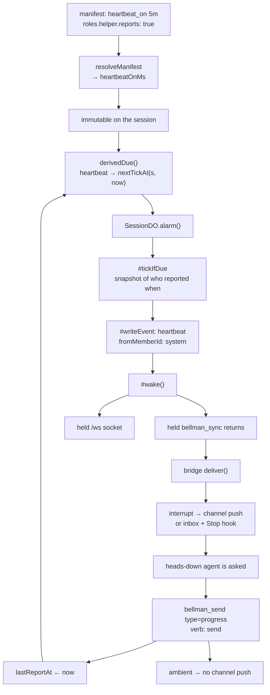

# Heartbeat Events — Design

Issues: [#111 Heartbeat events, and a member declaring that it will send them](https://github.com/bellman-sh/bellman/issues/111)
Status: approved design, pending implementation plan
Related: [#103](https://github.com/bellman-sh/bellman/issues/103) (liveness, shipped —
this is deliberately not that), [#99](https://github.com/bellman-sh/bellman/issues/99)
(the delivery path this rides on, shipped),
[#25](https://github.com/bellman-sh/bellman/issues/25) (`getSession` loads every
event — the cost D4 answers to), [#82](https://github.com/bellman-sh/bellman/issues/82)
and [#81](https://github.com/bellman-sh/bellman/issues/81) (the next two users of
the attention vocabulary in D9), [#66](https://github.com/bellman-sh/bellman/issues/66)
(the scribe, which acts on a quiet member), [#49](https://github.com/bellman-sh/bellman/issues/49)
(the dashboard D4's snapshot is shaped for),
[#78](https://github.com/bellman-sh/bellman/issues/78) (generating
`bellman_start`'s description — the mitigation for D12)

## Problem

The middle of every interaction is invisible. A member sends and then has
nothing: whether its peers received, started, are still going, or died. You
find out when a message arrives, or you never find out.

For a room holding a handful of members that is irritating. For a room holding
many it makes the room unusable, because waiting on five members with no idea
which are working **looks identical to waiting on five that have all crashed.**

Two different things get called heartbeat, and separating them is the whole
design:

| | Liveness | Progress |
|---|---|---|
| Says | "I exist" | "still working, currently on the migration script" |
| Carries | nothing | content |
| Arrives | on a timer | when asked |
| Purpose | inform the server | reach a peer |
| Home | `Member.lastSeenAt`, derived presence | events in the room |
| Issue | #103, shipped | **this one** |

#103 argued against a heartbeat event type, calling heartbeats "the
highest-volume, lowest-value events imaginable". D4 is the answer to that
critique, and it is the decision this design turns on.

### Why a declaration is the feature, not the event

Without a declaration, silence is ambiguous. A member that has gone quiet is
indistinguishable from one that never heartbeats at all. A member expected to
report and gone quiet is a signal a peer can act on; a member never expected to
report is noise.

### Why nothing in the room can be trusted to generate the cadence

The obvious design — a member reports on a cadence it was told about — does not
work, and it took a wrong turn in this design to see why.

An agent deep in a long task is the exact case heartbeats exist for, and it is
not calling Bellman. It is reading files, running tests, thinking. It calls
`bellman_sync` when it is **waiting on a peer**, which is the opposite of when
it should be reporting. So any mechanism that depends on the member noticing it
is due fires precisely when the information is least needed and stays silent
when it is most needed.

Nor can a client hold a timer. A hosted connector — ChatGPT, Claude Desktop —
has no local process and cannot wake itself. A design that needs one is a design
that works on one surface.

**So the server generates the cadence, and the server is the only party that
can.** It is also the only party that can see the whole room at once, which is
what makes the tick worth more than a nudge (D4).

## Decisions

### D1 — The server ticks. No member puts a heartbeat in the room.

A `heartbeat` event is appended by `SessionDO` itself, with
`fromMemberId: "system"`, exactly as `session_expired` and `member_timed_out`
already are. It is unreachable from `bellman_send`.

That is structural rather than conventional, and it matters for the reason the
architecture gives for the socket being receive-only: a member-writable
heartbeat would be a second entry to the write path, with the verb check,
frozen guard, idempotency record, payload-depth limit and audit write all
duplicated there and kept identical to the first. "Two delivery paths that must
not drift is already the cost of this design; two send paths would double it."

**The payoff is that the tick needs no new delivery machinery at all.**
`#wake()` resolves held long polls and sends to held sockets; the bridge's watch
loop returns, `deliver()` runs, and the event lands in a heads-down agent's
context through channel push or the inbox and Stop hook. The path already
exists and is already tested. A hosted connector that is not polling misses the
wake and reads the tick on its next `bellman_sync`, because it is a stored event
with a cursor — **invariant 6 holds: push is an optimisation, never a
dependency.**

### D2 — The room declares one cadence; a role declares who must answer.

- `manifest.heartbeatOnMs: number | null` — one schedule for the room.
- `RoleDef.reports: boolean` — whether members in this seat must answer it.

One cadence rather than one per role, because the tick is a single event for the
whole room and per-role intervals would mean several schedules, a partial
snapshot, and a due calculation spanning roles.

The per-role half is what keeps the signal clean. `swarm`'s `observer` holds
`can: []`; asking it to report work it does not do would name it silent for
behaving exactly as its role describes, and overdue reports nobody earned are
how a signal gets taught to be ignored.

Authors write a duration — `"30s"`, `"5m"`, `"1h"` — under the input key
`heartbeat_on`, matching the existing snake-case input convention
(`default_role`, `creator_role`). `resolveManifest` parses it to
`heartbeatOnMs`, because expansion happens there and only there: what the store
holds is always concrete, and nothing downstream learns that durations or
presets exist.

Bounds are **30s to 1h**. Below 30s it is a liveness timer, which is #103's job.
Above an hour the cadence says nothing a peer could act on inside a working
session.

The manifest is immutable after `createSession`, so the cadence cannot drift
under a room mid-life. A peer reading silence reads it against the same number
every member was given.

### D3 — No preset expects a heartbeat.

`pair`, `swarm` and `review` all resolve `heartbeatOnMs: null`, with
`reports: false` on every role.

Turning this on for shipped presets would start ticking every room anyone
already runs and naming members silent who were never asked for anything. The
feature's value rests entirely on a tick being worth reading, and the fastest
way to destroy that is to ship a wave of them nobody earned.

The mechanism lands opt-in, reachable by authoring a manifest. A preset that
expects heartbeats is a follow-up worth doing once a real room has used it.

### D4 — The tick carries the roster snapshot. That is what earns its place in the log.

A 5-minute cadence is 288 events a day, 8,640 over a 30-day team-plan room, and
#25 is literally "`SessionDO.getSession` loads every event on every call". A
content-free tick on a timer is #103's "highest-volume, lowest-value events
imaginable", and this time the critique would be right.

So the tick is not content-free. **The server is the only party that can see the
whole room**, so the tick carries what only it knows — for every member that
must report:

- `member_id` and `label`
- `last_report_at` — ISO 8601, or null if it has never reported
- `silent_for_seconds` — a measurement taken at `at`
- `silent: boolean` — past the second threshold (D10)

Plus the ask itself: the cadence, and the call to answer it.

That inverts the volume critique rather than arguing with it. A periodic
room-state snapshot is the highest-value recurring row the log could hold: it is
what #49's dashboard renders, what #66's scribe acts on, and a direct answer to
this issue's own complaint that **"a room says nothing about its own state."**

**Invariant 7 is unweakened.** The invariant forbids presence in a payload
because "present" is a claim about **now**, which replay re-asserts hours later.
Every field above is a claim about `at` — "had been silent 660 seconds at 14:05"
was true then and stays true forever. The snapshot therefore carries **no**
`present`, `status`, `alive` or `healthy` key, and derived presence stays
derived. §10 of the architecture gains a sentence saying why this is not a
counterexample.

### D5 — The tick is a derived named alarm, mirroring `ttl`.

`SessionDO.alarm()` already dispatches named handlers from `driver.dueNow(now)`,
and `derivedDue()` already computes a due time from the session record rather
than storing one. A heartbeat is the same shape as the TTL:

- `derivedDue()` adds `["heartbeat", nextTickAt(s, now)]`
- `alarm()` gains a branch calling `#tickIfDue(s, now)`
- `#tickIfDue` mirrors `#expireIfDue`: build the event, `#writeEvent`, `#wake`

**Derived rather than stored, deliberately.** `alarm()`'s comment warns that a
name the driver can report with no branch below is never consumed, so the
closing `reArm()` points the alarm back at it and it fires back to back for
good — the documented rollback hazard for `due:outbox`. A derived due time
cannot do that: a build that does not know the name does not compute it either,
so **rolling back past this change strands nothing and needs no cleanup.**

**This corrects an earlier ruling in this design, which rejected an alarm on
cost grounds.** That conflated two billing shapes:

| | Cost |
|---|---|
| Held long poll (what #99 removed) | object **resident**: 3,600 s of duration per watched hour |
| Alarm firing | brief invocation: ~12 × tens of ms, **under a second** per hour |

Three orders of magnitude apart. And decisively, **`ttl` already arms an alarm
on every live session** — the object is already waking on a schedule, so adding
a handler to an alarm that exists is close to free. #99's cost curve is about
residency, and nothing here holds a request.

### D6 — The tick interrupts. A reply does not.

`heartbeat` is `interrupt`; `progress` is `ambient` (D9).

This is the asymmetry the whole feature rests on. The tick must interrupt,
because interrupting a working agent to ask where it is **is the feature** — the
room asked for it, and a tick nobody reads generates no report. A reply must not,
because a peer that cares is already looking, and progress notes landing in a
peer's context every five minutes are worse than silence.

Put the other way round: **a report is discoverable by waiting, and the absence
of one is not.** The tick carries the absence (D4), so the tick is the loud half.

### D7 — The reply is a member send kind, and its payload may not claim liveness.

A sixth `SEND_KINDS` entry, `progress`, which is how a member answers a tick:

- `note` — string, 1 to 500 chars
- `step` — optional string, ≤ 40 chars
- `eta_seconds` — optional number

A `z.strictObject`, so every unknown key is rejected and `status` / `alive` /
`healthy` / `state` cannot appear. A denylist would fall behind the first name
somebody forgot to add; this is also the existing idiom (`RoleDefShape`).

A reply is a claim about `at`, same as the snapshot. A member may answer a tick,
answer late, or never answer — the next tick reports which, and that is the
entire enforcement model. **The cadence is observable, not compellable**, and
making non-compliance visible is the design's job rather than making it
impossible.

An append sets `Member.lastReportAt`, which is the one new stored fact: when
this member last reported. Absent on rows written before the field existed, read
through an accessor that lifts those to `joinedAt`, the way `lastSeen` does.
Durable Object storage has no migration step, and a persisted type that gains a
field is silently a union with `undefined` for as long as old records live.

### D8 — `send` is the verb for a reply. No new verb.

`SEND_VERB.progress = "send"`.

`manifest.ts` is explicit that a verb lands only in the PR that adds its
operation, because "adding one sooner lets a role's `can` promise something no
code can keep." Nothing here needs a `report` verb: a seat that may not speak
may not report either, the same reasoning `brief_update` carries, and
`RoleDef.reports` already answers who is asked.

The tick needs no verb at all. The server is not a member and holds no role.

### D9 — Attention is a declared property of an event type, and it is on the wire.

A new `src/attention.ts` holds one table, closed over `EventType`:

- `progress` → `ambient`
- `heartbeat` → `interrupt`
- every one of the twelve existing types → `interrupt`

`satisfies Record<EventType, Attention>`, so **a new event type must declare its
posture or the build stops** — the `SEND_VERB` pattern, used to force a verb
choice per send kind.

**The twelve existing types keep the behaviour they have today.** The table
introduces a classification, not a change: nothing that currently reaches a peer
mid-turn stops doing so. `invite_issued` and `member_joined` have a reasonable
case for being ambient, and re-classifying either is a separate change with its
own argument to make.

`publicEvent` emits `ambient: true` and omits the key otherwise — no added bytes
for those twelve, and a client that has never heard of `progress` keeps working.
It goes in `publicEvent` rather than a table inside the bridge because
`publicEvent` is the one projection both transports share, so a hosted
connector, a future dashboard and the bridge read one answer without any of them
owning a type list.

`deliver()` in `src/bridge.ts` reads the field rather than naming types.

**This is what #82 and #81 reuse.** Both are this issue's complaint from another
angle — #82 that `delivered_to` implies delivery, #81 that an action request has
no state — and both land as event types that declare their posture here. That is
what keeps the three from producing three vocabularies for "what is happening in
here."

### D10 — The tick fires only when somebody is due, and never into a room that cannot answer.

`nextTickAt(session, now)` is the earliest `lastReportAt + heartbeatOnMs` across
members that must report. So a room where everyone reports promptly ticks less
often, and a room nobody is answering ticks at the cadence — the volume tracks
the need.

Two thresholds, kept from the same reasoning `STALE_AFTER_MS` is chosen for:

- **1× the cadence** — the member is due, and the tick asks.
- **2× the cadence** — the member is `silent: true` in the snapshot.

A member therefore gets a full interval of being asked before any peer is told
it has gone quiet. A false silent is worse than a late one: being late costs a
peer learning a few minutes after it could have, and being wrong costs every
peer learning to ignore the signal.

No tick is written when the room is **frozen, closed, or holds no member that
must report**:

- A member cannot report its way out of a frozen room, so none may be named
  silent in one. A freeze must cost nobody their standing, which is the same
  rule that keeps `reclaimStaleSeats` out of a frozen room.
- A closed session derives no due time, for the reason `derivedDue` already
  gives about the TTL: deriving one would re-arm the alarm to a time already
  past and fire for as long as the object existed.

### D11 — Overdue is the tick's business. There is no `member_overdue`.

An earlier draft of this design had a `member_overdue` event, an
`Member.overdueAt` field to stop it repeating, a `heartbeat_due` flag and a
`heartbeat_note` sentence on the `bellman_sync` response. D4 collapses all four:
the tick names the silent member, so **the tick is the overdue announcement**, at
exactly the right granularity by construction and with no extra state to keep
consistent.

It also removes the subtlest part of that draft — an announcement that had to
fire at most once per lapse, inside the store's append operation, to stop two
concurrent appends both announcing it. The alarm is one invocation by
construction, so the invariant 9 window never opens.

### D12 — The token cost, stated rather than absorbed.

§11 of the architecture measures tool definitions at ~4,820 tokens **on every
request**, with `bellman_start` alone at 1,462 — 30% of the budget, "paid even
by sessions that only ever join."

This design adds `heartbeat_on` and `reports` to the manifest schema inside
`bellman_start`, and `progress` to `bellman_send`'s kind list and description.
It adds **nothing** to `bellman_sync`, because D11 removed the flag and the
sentence an earlier draft put there — the ask travels in the tick's payload,
paid by rooms that use the feature, rather than in a tool description paid by
everyone.

The implementation re-measures tool definitions and records the delta. #78
proposes generating `bellman_start`'s description, which also makes it
measurable, and is the real mitigation.

### D13 — The word "heartbeat" now means one thing, and two comments must be corrected.

`presence.ts` says, of liveness, "Not a heartbeat event." §5 of the architecture
says the same and gestures at this issue. Both were written when the word was
unclaimed; with a `heartbeat` event shipping, each now reads as a contradiction.
Both are corrected here rather than left for a reader to reconcile.

| Name | Is |
|---|---|
| `heartbeatOn` / `heartbeatOnMs` | the room's cadence for the tick |
| `RoleDef.reports` | whether members in this seat must answer a tick |
| `heartbeat` | the **server's** tick event, carrying the roster snapshot |
| `progress` | a **member's** reply, carrying its note |
| `lastReportAt` | fact: when a member last replied |
| `ambient` / `interrupt` | D9's attention posture |

Nothing here is named for liveness, and nothing in #103 is named for progress.

## Architecture

The loop closes on itself: a reply moves `lastReportAt`, which moves
`nextTickAt`, which is what `derivedDue` computes on the next `reArm()`. No
state tracks the cadence; it falls out of the one fact a reply writes.

### Where this cannot live behind the store

The tick is a `SessionDO` alarm, and `MemoryStore` has no alarms. So **the tick
is not a `BellmanStore` method** — it follows the precedent `/ws` set: a
`watch()` on the interface "could be honoured by one implementation only, and
the conformance suite is what makes the interface a seam."

What that means in practice:

- The **pure rules** — `nextTickAt`, `snapshotOf`, `mustReport(manifest, role)`,
  the two thresholds — live in `src/heartbeat.ts`, runtime-free, importable by
  both test programs and by `SessionDO`.
- The **tick firing** is tested in `worker-tests/` under real Durable Objects,
  because nothing else can fire an alarm.
- The **reply** is an ordinary append and stays fully inside the store contract.

One consequence matters for anyone working on this: **`npm start` with `MemoryStore` never
ticks.** Exercising this feature locally means `npm run dev:worker`. That is the
same limitation the hibernating socket has, for the same reason.

## Testing

Two programs, as always: anything importing `cloudflare:workers` cannot be
imported by a vitest test, so the pure rules sit in a runtime-free module beside
the code that uses them.

- **`tests/helpers/store-contract.ts`** covers the reply: a `progress` append
  sets `lastReportAt`; a row written before the field existed reads as
  `joinedAt`. It runs against `MemoryStore` in the root program and
  `DurableObjectStore` in `worker-tests/`.
- **`src/heartbeat.ts` is unit-tested directly** — `nextTickAt` across members
  with mixed report times, the 1× and 2× thresholds, a role with
  `reports: false` excluded from both, and an unknown role excluded (fail
  closed, the way `verbsOfRole` does).
- **`worker-tests/` covers the alarm**: a tick fires at the cadence; a reply
  pushes the next tick out; a frozen room writes none; a closed room arms none;
  a room with no reporting member arms none; and the rollback property — an
  object with no heartbeat branch strands no due row, because the due time is
  derived.
- **The attention table is asserted against the real event-type union**, so a
  type added without a posture fails rather than defaulting.
- **Delivery is tested through the bridge's `deliver()`**, not only the table: a
  tick must produce a channel push and a reply must not. Testing the classifier
  while the delivery path ignores it is the gap that matters.
- **`bellman_connect`'s preview shows the cadence and whether the seat must
  report.** That is the consent point, and a joiner accepting an unseen
  obligation is the failure.
- **`extension/manifest.json` is unchanged, and that is asserted.** No new tool
  ships, so the Desktop bundle's list does not move; `tests/extension.test.ts`
  already fails if it does.

Two rules this repo has paid for, applying to every test above:

1. **Run each new assertion against a broken implementation before trusting
   it.** An assertion nobody has seen fail is not evidence.
2. **A check needs a positive control.** Make it fail on purpose before calling
   it verification.

## Files

| File | Change |
|---|---|
| `src/types.ts` | `EventType` += `heartbeat`, `progress`; `RoomManifest` += `heartbeatOnMs`; `RoleDef` += `reports`; `Member` += `lastReportAt?` |
| `src/manifest.ts` | `heartbeat_on` duration parse with bounds, `reports` on `RoleDefShape`, presets resolve null/false |
| `src/heartbeat.ts` | new — `nextTickAt`, `snapshotOf`, `mustReport`, the two thresholds. Runtime-free |
| `src/attention.ts` | new — the `ATTENTION` table and `Attention` type |
| `src/public-event.ts` | emit `ambient: true` for ambient types |
| `src/roles.ts` | `mustReport` accessor beside `verbsOfRole`, fail-closed |
| `src/presence.ts` | correct the "Not a heartbeat event" comment (D13) |
| `src/store-do.ts` | `derivedDue` += heartbeat, an `alarm()` branch, `#tickIfDue` |
| `src/server.ts` | `SEND_KINDS`, `SEND_VERB`, the `progress` payload shape, `bellman_connect`'s preview |
| `src/store.ts` | `lastReportAt` on a `progress` append |
| `src/bridge.ts` | `deliver()` reads `ambient` |
| `tests/helpers/store-contract.ts`, `worker-tests/` | as above |
| `docs/ARCHITECTURE.md` | §5 the liveness/heartbeat distinction, §9 the new derived alarm, §10 why invariant 7 is unweakened, §11 the re-measured token cost |

## Out of scope

- **Automatic liveness** — #103, shipped. `lastSeenAt` and derived presence
  answer a different question, and D13 keeps the names apart.
- **Housekeeping that acts on a quiet member** — #66. The scribe needs
  authority before an agent may nudge or close anything. This work gives it the
  signal, not the authority.
- **A preset that expects heartbeats** — D3 ships the mechanism opt-in on
  purpose.
- **#82 and #81** — they reuse D9's vocabulary and are not fixed here.
- **A human-visible view** — #49. D4's snapshot is shaped for it; rendering it
  is that issue.
- **Compelling a reply.** D7 is explicit that the cadence is observable, not
  compellable. A room that wants consequences for silence wants #66.
- **Ticking under `MemoryStore`.** `npm start` has no alarms, so local
  development exercises this through `npm run dev:worker`.
